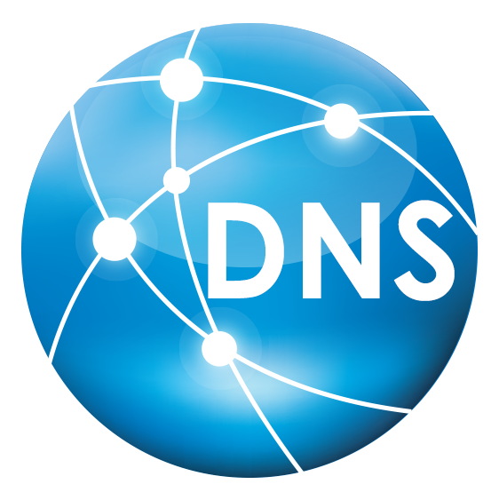

# Configuración de DNS Master-Slave con Bind9

## Descripción del Proyecto
Proyecto personal de **Administración de Sistemas** enfocado en la configuración de un servidor DNS autoritativo con Bind9 en arquitectura master-slave para redundancia y alta disponibilidad.

Características principales:
- Zona directa con registros A (servidores, dns-master/slave), CNAME (www, ftp, cloud).
- Zona inversa con registros PTR para resolución reverse.
- Transferencias de zona permitidas entre master y slave (allow-transfer { 10.0.2.6; }).
- Visualización y gestión mediante Administrador de DNS en Windows.
- Pruebas con nslookup para resolución forward (A, CNAME) y reverse (PTR).

Entorno reproducible en red local con IPs 10.0.2.x.

## Tecnologías y Herramientas Utilizadas
- **Bind9** (master y slave)
- **Linux** para edición de archivos (/etc/bind/named.conf.local, db.olive.local, db.10.0.2)
- **Windows DNS Manager** para interfaz gráfica
- **nslookup** para verificaciones

## Objetivos Alcanzados
- Implementación master-slave con sincronización de zonas.
- Registros DNS variados para servicios (web, ftp, cloud).
- Resolución completa forward y reverse.
- Verificación desde múltiples servidores.

## Proceso Completo – Capturas Paso a Paso

  
  
  
  
  
  
  
  
  
  
  

## Aprendizajes Clave
- **Master-Slave en Bind**: Sincronización y transferencias seguras.
- **Zonas y Registros**: Directas (A, CNAME, NS, SOA), inversas (PTR).
- **Verificaciones**: nslookup para testing forward/reverse.
- Integración Windows-Linux para gestión DNS.

## Relevancia Profesional
Habilidades para:
- Redes empresariales (redundancia DNS).
- DevOps/Cloud (base para DNS gestionados).
- Ciberseguridad (configuraciones seguras).

## Conclusión
Proyecto funcional con DNS redundante, listo para escalar.

¡Gracias por visitar! Dale ⭐ si te gusta.

---
**Autor**: Pau Olivé Moreno  
**Fecha**: Principios de 2025